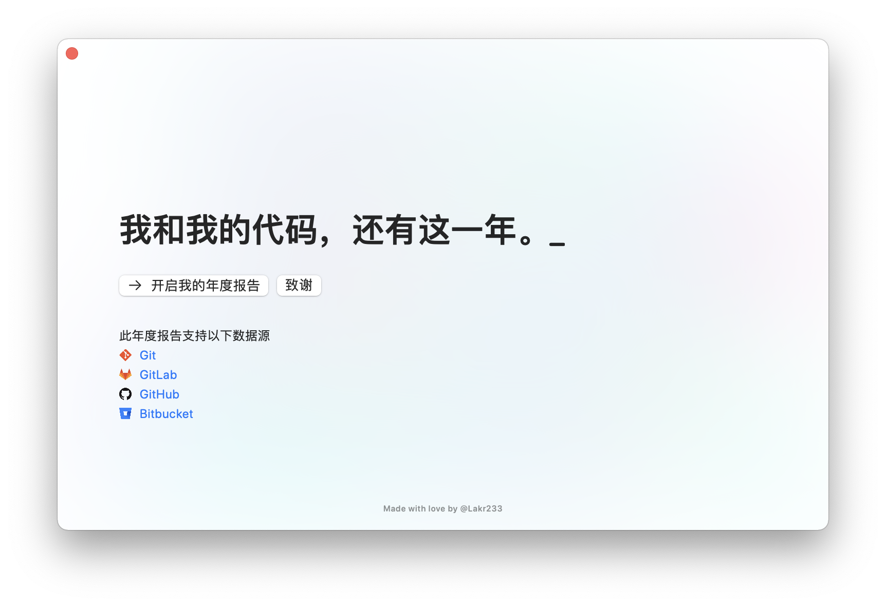

# 我和我的代码，还有这一年。

## 预览

**Chinese Only!**

按道理这里是要放几张预览图片并配上一句话的说明的。本程序目前支持使用常见 Git 仓库托管提供商以及本地代码仓库进行分析。

## 彩蛋

此程序包含一些彩蛋，如果能在不修改程序源码的情况下触发彩蛋，可以上推发送完整截图并联系 @Lakr233 获取奖品 0 份。彩蛋的格式为 flag{xxxxxx}。

## 一些说明

### 记得分享

不给别人看的年度报告是没有灵魂的。

### 关于没有数据

- 请检查你的提交邮箱，虽然会自动配置但是可能存在遗漏的问题。
- 请检查你的 git log 格式，请勿手动修改时间格式。
- 请检查 git 版本，测试的版本为 `git version 2.30.1 (Apple Git-130)`。

### 关于沙盒

请悉知此应用程序并没有开启沙盒安全选项，他有能力访问你系统中的全部资源。考虑到此程序需要处理的数据的特殊性，我们在此说明一些情况。

- 由于此程序使用系统内置的 git 进行相关操作，不能启用沙盒。如果需要启用沙盒，你需要自行内嵌 git 二进制。
- 此应用仅在本地分析和处理数据，**不会上传任何数据**。
- 苹果针对敏感的数据进行了加强保护，即使没有启用沙盒，你出存在文档、照片等目录的文件仍然收到额外的保护。访问时会要求你明确授权。
- 应用程序已经上传 Apple 进行无害化公证，运行前请检查代码签名。

### 关于使用程序的一些注意事项

- 如果统计数据存在问题，请检查你的提交邮箱。
- 我们**不对数据的完整性、准确性做任何保证**。
- **使用 token 批量拉取仓库可能会触发你司的安全警报，公司仓库建议使用本地分析。**
- 自行上传分析结果分享到社交网络前**请通读报告并检查其中内容是否涉密**。

## 免责声明

我们不对使用本程序造成的任何后果承担任何责任。下文中，我们列出了一些可能发生的内容，请悉知。

- 计算机死机，卡顿，重启。
- 计算机芯片烧毁。
- 花屏，白屏，黑屏，闪屏 。
- 你上班迟到。
- 被妻子女儿痛骂写的什么玩意。
- 被老板看到你在摸鱼。
- 被辞退。
- 泄漏机密信息被安全部门处理。
- 变得不幸。
- **变成猫猫。**
- 地球爆炸。
- 宇宙重启。

## 使用许可

本程序及其源码和编译产物附属[MIT](LICENSE)许可，其生成展示的内容与相关图标和符号不做许可承诺，请参考他们的原始许可。

**请不要售卖本程序。因为这样做会有人受伤。**

🥺

---

Copyright © 2021 Lakr Aream. All Rights Reserved.